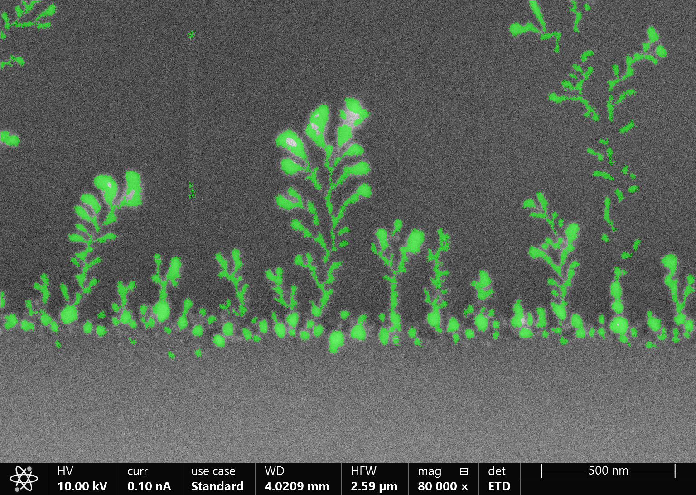
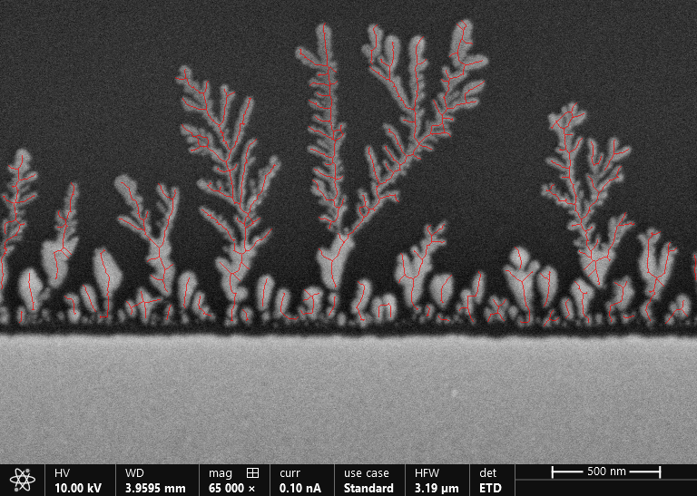
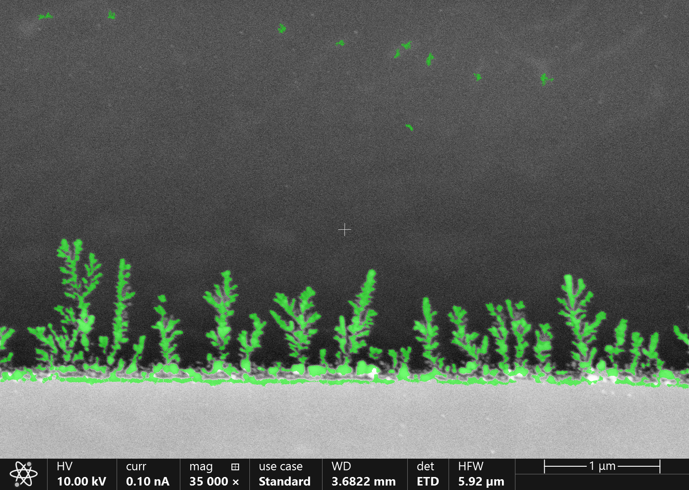
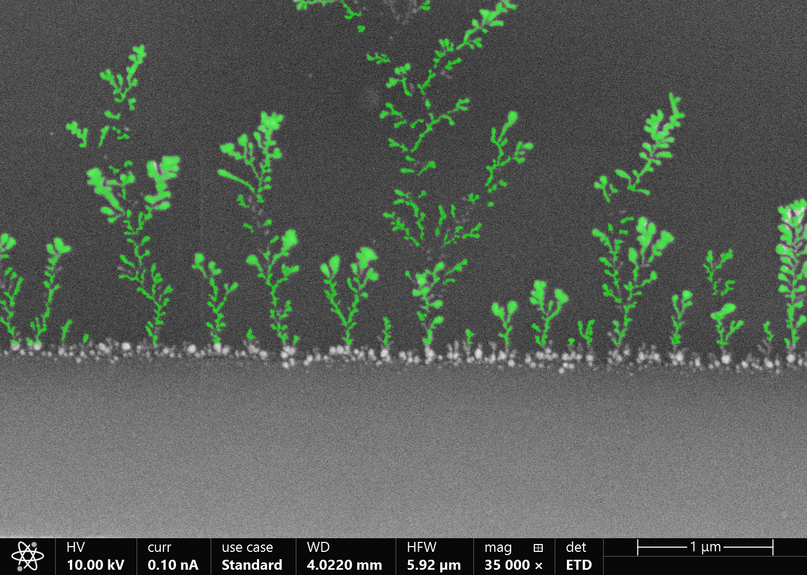
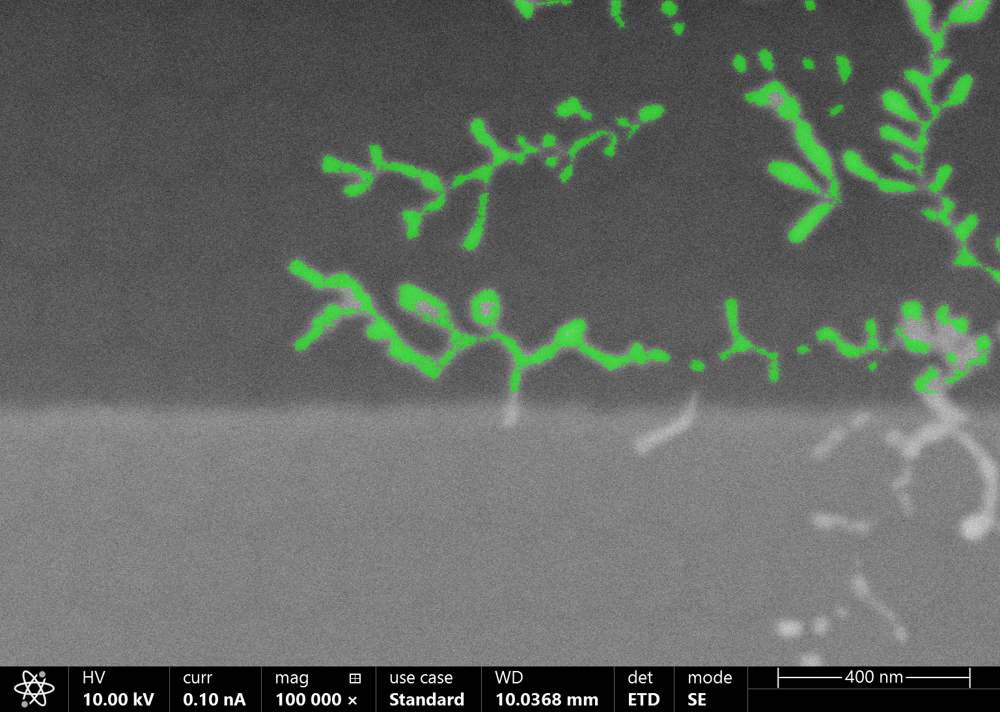
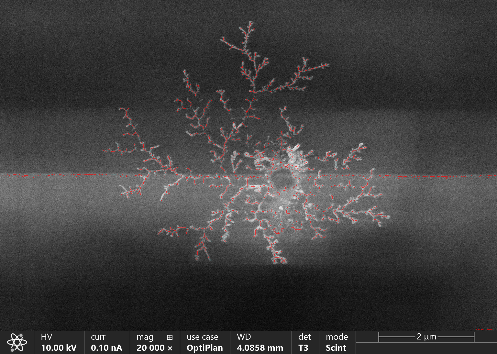
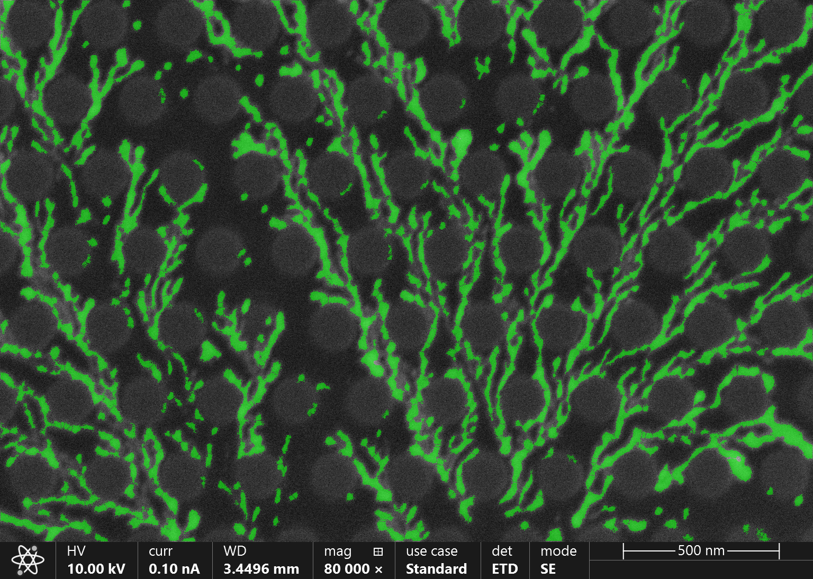
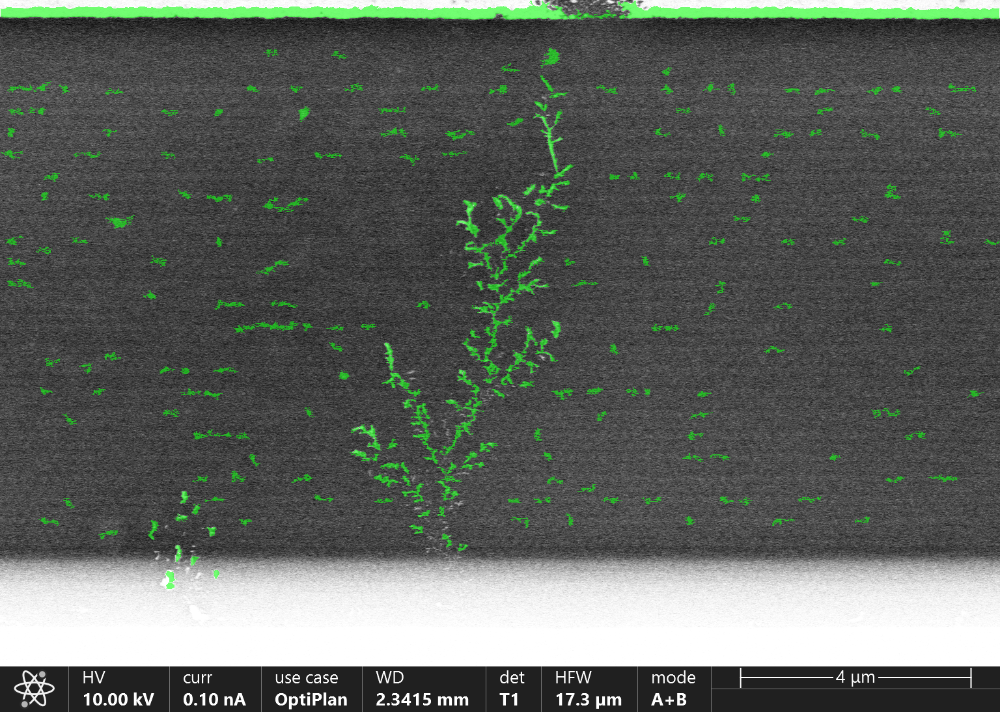
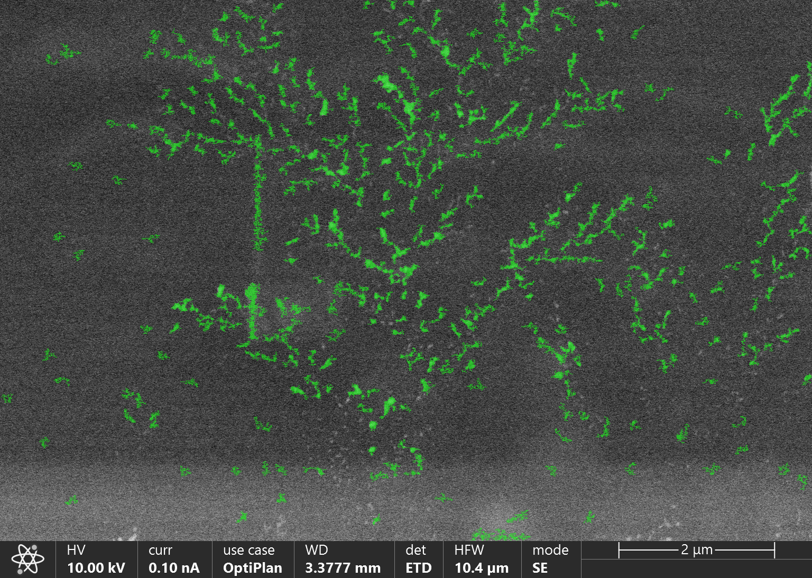

# סגמנטציה של דנדריטים בתמונות SEM

מגישים: **Michael Babiy**, **Shlomo [להשלים שם משפחה]**  
ת"ז: **323073734**, **[להשלים]**

## 1. תקציר

בפרויקט זה פותחה מערכת לסגמנטציה אוטומטית של דנדריטים בתמונות SEM. מטרת המערכת היא להפריד בין מבנה הדנדריט לבין הרקע, להסיר ארטיפקטים אופייניים של המיקרוסקופ, ולהפיק גם שלד חד-פיקסלי לצורך ניתוח מבני עתידי.  

הפתרון המרכזי שמומש מבוסס על pipeline קלאסי לעיבוד תמונה, הכולל נרמול היסטוגרמה, שיפור ניגודיות מקומי באמצעות CLAHE, סינון bilateral משמר קצוות, סגמנטציה באמצעות adaptive thresholding, ניקוי מורפולוגי, הסרת אזורי רקע בעייתיים כגון קו בסיס ופסים עליונים, הפרדת ענפים נוגעים באמצעות distance transform ו-Watershed, ולבסוף Skeletonization. בנוסף נבנה GUI אינטראקטיבי לצורך כיוונון פרמטרים, ניתוח שלבים והשוואה בין קונפיגורציות שונות.

ממצאי הפרויקט מראים כי ה-pipeline הקלאסי מספק תוצאות חזקות במיוחד בקבוצת התמונות הקלות, וכן בחלק מן התמונות הקשות. ברוב מקרי הכמעט-הצלחה הכשל איננו כשל יסודי של הסגמנטציה, אלא בעיית ניקוי מקומית, בעיקר סביב `baseline cut` או `top band removal`. בהתאם לכך, הדוח מתמקד בדוגמאות המייצגות ביותר, לצד מספר מקרי גבול שמסבירים היכן נדרש שיפור נוסף.

## 2. מתודולוגיה

### 2.1 הגדרת הבעיה

דנדריטים הם מבנים מתכתיים מיקרוסקופיים בעלי גיאומטריה מסועפת, הצומחים על פני האנודה במהלך מחזורי טעינה ופריקה של סוללות ליתיום. צמיחתם עלולה לגרום לקצר פנימי ולכן יש חשיבות גבוהה לזיהויים ולמדידתם מתוך תמונות SEM.  

האתגר המרכזי בסגמנטציה של דנדריטים נובע מכך שתמונות SEM כוללות רעש, אי-אחידות בתאורה, אזורי רוויה, קווי רקע בוהקים ולעיתים גם טקסטורות מחזוריות הדומות חזותית לענפים דקים. מסיבה זו, שיטות סף גלובליות פשוטות אינן מספקות ברוב המקרים.

### 2.2 ה-pipeline הקלאסי

ה-pipeline הקלאסי שפותח בפרויקט בנוי מארבעה שלבים עיקריים:

1. **קדם-עיבוד**: ניקוי טקסט ו-scale bar, נרמול היסטוגרמה, CLAHE וסינון bilateral.
2. **סגמנטציה**: שימוש ב-adaptive thresholding, עם אפשרות גיבוי ל-Otsu.
3. **ניקוי לאחר סגמנטציה**: reconstruction מורפולוגי, `baseline cut`, הסרת substrate, הסרת top band, הסרת רעשי שוליים והסרת רכיבים קטנים.
4. **עיבוד מבני**: הפרדת ענפים נוגעים באמצעות distance transform ו-Watershed, ולאחר מכן Skeletonization.

מבנה זה נבחר משום שהוא מאפשר שליטה גבוהה בכל שלב, שקיפות מלאה בתהליך, ויכולת ברורה להבין מדוע תוצאה מסוימת הצליחה או נכשלה.

### 2.3 ה-GUI ככלי ניתוח וכיוונון

לצורך כיוונון המערכת נבנה GUI אינטראקטיבי המאפשר לעבור על כל שלבי ה-pipeline בזמן אמת:

- `01_original`
- `02_cleaned`
- `03_normalized`
- `04_clahe`
- `05_bilateral`
- `06_segmented`
- `07_reconstructed`
- `08a_after_baseline_cut`
- `08b_after_substrate_removed`
- `08c_after_top_removed`
- `08d_after_edge_removed`
- `08e_after_bottom_artifact_removed`
- `08_small_removed`
- `09_separated`
- `10_skeleton`

הממשק שימש ככלי מרכזי להבנת מקרי שגיאה. בפרט, הוא אפשר לזהות במדויק מתי הפגיעה בתוצאה נובעת מ-`baseline cut` אגרסיבי מדי, מתי פס עליון לא הוסר עד הסוף, ומתי בעיית הקלט עצמה היא המגבלה העיקרית.

### 2.4 ה-pipeline המבוסס Deep Learning

לפי דרישות הפרויקט, יש להתייחס גם ל-pipeline מבוסס Deep Learning. במסגרת הפרויקט הוכנה תשתית ל-YOLO-Seg, כולל מבנה דאטהסט, קבצי תיוג בפורמט מתאים, וקבצי משקלים.  

בפועל הוכנה תצורת אימון המבוססת על `yolo11n-seg.pt`, עם `epochs=100`, `imgsz=640`, `batch=8`, `patience=20`, `freeze=10`, `lr0=0.001` ו-`conf=0.25` לאינפרנס. הדאטהסט הקיים בפרויקט קטן מאוד וכולל `7` תמונות אימון, `1` תמונת validation ו-`2` תמונות test. לכן, מבחינה ניסויית, תפקיד ה-pipeline הזה בשלב הנוכחי הוא בעיקר לשמש תשתית השוואה וכיוון עתידי, ולא בסיס בלעדי למסקנה סופית.

מבחינה מתודולוגית, יתרונו של pipeline זה הוא ביכולת ללמוד מאפיינים סמנטיים ולהבדיל טוב יותר בין דנדריט לבין רקע מורכב או מחזורי. חסרונותיו הם תלות בדאטה מתויג איכותי, הצורך בתהליך אימון מסודר, ופחות שקיפות ביחס ל-pipeline הקלאסי. על סמך הריצה הקיימת, נצפתה תנודתיות גבוהה במדדי ה-mAP לאורך האימון, דבר המחזק את ההבנה שהדאטהסט הנוכחי קטן מדי להשוואה כמותית יציבה.  

בגרסת העבודה הנוכחית של הדוח, עיקר הניתוח האיכותני מתמקד ב-pipeline הקלאסי, משום שזהו החלק שעבר כיוונון שיטתי וניתוח מעשי מפורט על התמונות שנבחרו.

### 2.5 פירוט מלא של ה-pipeline הקלאסי

#### שלב א: קדם-עיבוד

בשלב הראשון התמונה עוברת ניקוי של פסי metadata ושל טקסט המיקרוסקופ, ולאחר מכן מתבצע נרמול היסטוגרמה לטווח `[0,255]`. מטרת הנרמול היא לייצר בסיס עקבי בין תמונות בעלות חשיפה שונה. לאחר מכן מופעל CLAHE, שמבצע שיפור ניגודיות מקומי במקום שיפור גלובלי, וכך מאפשר להבליט ענפים חלשים גם כאשר התאורה איננה אחידה.

לאחר שיפור הניגודיות מופעל bilateral filter. בניגוד לטשטוש גאוסי רגיל, bilateral מנסה להחליק רעש בלי למחוק קצוות חזקים. בשפה מעשית, זה השלב שמנסה להקטין grain של SEM אך עדיין לשמור על גבולות הדנדריט.

#### שלב ב: סגמנטציה

בשלב הסגמנטציה מיוצרות בפועל שתי מסכות:

1. מסכת adaptive thresholding.
2. מסכת Otsu.

לאחר מכן המערכת בודקת מהי המסכה הסבירה יותר מבחינת יחס foreground, בעיקר באזור העליון של התמונה שבו מצופה להופיע הדנדריט. בנוסף מתבצע תיקון polarity אם foreground הופך לרוב הפיקסלים. בפועל, adaptive thresholding הוא השלב המרכזי, ו-Otsu משמש בעיקר כגיבוי כאשר adaptive נותן יחס foreground לא סביר.

#### שלב ג: ניקוי לאחר סגמנטציה

זהו השלב החשוב ביותר מבחינת יציבות, והוא גם השלב שבו בוצעו רוב התיקונים במהלך הניסויים. תחילה מתבצע morphological reconstruction: המסכה נשחקת ל-marker קטן יותר, ואז נבנית מחדש בתוך גבולות המסכה המקורית. המטרה היא למחוק רעש חלש אך עדיין לשמר ענפים שמחוברים לגזע הראשי.

לאחר מכן מופעל בלוק הניקוי של שלב 8, שהופרד למספר תתי-שלבים:

1. `08a_after_baseline_cut` – חיתוך שורות צפופות מתחת לקו הבסיס.
2. `08b_after_substrate_removed` – הסרת substrate בעזרת foreground scan או intensity profile.
3. `08c_after_top_removed` – הסרת פס עליון צפוף.
4. `08d_after_edge_removed` – הסרת specks קטנים שנוגעים ממש בשוליים.
5. `08e_after_bottom_artifact_removed` – הסרת קווים אופקיים דקים בחלק התחתון.
6. `08_small_removed` – הסרת רכיבים קטנים לפי סף שטח אדפטיבי.

ההפרדה הזו היתה קריטית, משום שהיא חשפה שהבעיה בתמונות הקשות לא היתה "רכיבים קטנים" בלבד, אלא אינטראקציה בין מספר צעדי ניקוי שקדמו לכך.

#### שלב ד: הפרדה ושלד

אחרי ניקוי המסכה, מופעל distance transform. השלב הזה מסמן את ליבות הענפים, ואז בעזרת Watershed ניתן לפצל ענפים שנוגעים זה בזה. לאחר מכן מתבצע Skeletonization כדי להמיר את המסכה לקווי אמצע חד-פיקסליים.

השלד עובר pruning בשני שלבים:

1. הסרת רכיבי שלד זעירים וקווים אופקיים מלאכותיים.
2. הסרת spurs, כלומר שלוחות קצרות מאוד שאינן מייצגות ענף אמיתי אלא תוצר לוואי של רעש או של חוסר חלקות במסכה.

### 2.6 בחירת פרמטרים ותהליך הניסויים

בחירת הפרמטרים לא בוצעה באופן חד-פעמי, אלא באמצעות תהליך איטרטיבי של ניסויי A/B ב-GUI. בכל ניסוי שינינו פרמטר אחד או קבוצה קטנה של פרמטרים, ובחנו את ההשפעה על כמה תמונות Easy וכמה תמונות Hard. בכל מקרה לא הסתפקנו במסכה הסופית בלבד, אלא עברנו שלב-שלב על intermediate outputs כדי לזהות היכן נוצר הרווח והיכן נגרם הנזק.

#### הניסויים המרכזיים שבוצעו

1. **ניסוי על סף אדפטיבי**:  
   נבדקו ערכים שונים של `ADAPTIVE_BLOCK_SIZE` ו-`ADAPTIVE_C`. נמצא כי `ADAPTIVE_C = -12` הוא הפרמטר המשמעותי ביותר בכל ה-pipeline. כאשר הזזנו את `C` לכיוון `0`, המסכה התרחבה והפכה רועשת יותר; כאשר הקטנו אותו יותר מדי, הענפים הדקים נעלמו. גם `ADAPTIVE_BLOCK_SIZE = 67` נבחר לאחר שנמצא כי חלון קטן יותר גורם למסכה עצבנית ומחוררת, ואילו חלון גדול מדי מפספס פרטים מקומיים.

2. **ניסוי על שיפור ניגודיות ודנויזינג**:  
   ערכי CLAHE גבוהים יותר אמנם גרמו לדנדריטים חלשים "לקפוץ" החוצה, אך במקביל חיזקו גם רעש והילות סביב קצוות. לכן נבחר `CLAHE_CLIP_LIMIT = 0.5` ו-`CLAHE_TILE_SIZE = 8`, שהם ערכים עדינים יחסית.  
   עבור bilateral filter נמצא כי יותר ממעבר אחד שיפר את הרעש, אך גם ריכך ענפים דקים. לכן נבחר `BILATERAL_PASSES = 1` יחד עם `BILATERAL_D = 9`, `BILATERAL_SIGMA_COLOR = 50`, `BILATERAL_SIGMA_SPACE = 50`.

3. **ניסוי על reconstruction**:  
   המטרה היתה למחוק specks בלי לפרק את הדנדריט. כאשר הגדלנו את השחיקה או את מספר האיטרציות, קיבלנו marker קטן מדי, והבניה מחדש כבר לא הצליחה לשחזר היטב ענפים חלשים. לכן נבחרו `EROSION_KERNEL_SIZE = 3` ו-`EROSION_ITERATIONS = 1`. בנוסף הוגדר `RECON_MIN_KEEP_RATIO = 0.72`, כדי שאם reconstruction מוחק יותר מדי foreground, תהיה חזרה אוטומטית למסכה שלפניו.

4. **ניסוי על baseline ו-substrate**:  
   כאן בוצעה עבודה רבה במיוחד, כי התמונות הכמעט-מוצלחות נפלו בדרך כלל באזור התחתון. `BASELINE_DETECT_MIN_ROW_RATIO = 0.80` ו-`BASELINE_DETECT_SEARCH_START_RATIO = 0.60` נבחרו כך שהחיפוש יתחיל בחצי התחתון של התמונה אך לא יחתוך מוקדם מדי.  
   בנוסף נוספה הגבלה חשובה: `SUBSTRATE_MAX_ROWS_ABOVE_BASELINE = 8`. זו אחת המסקנות המרכזיות מהניסויים, משום שלפני כן הסרת ה-substrate עלתה גבוה מדי וחתכה שורשים אמיתיים.

5. **ניסוי על רכיבים קטנים**:  
   בתחילה סף רכיבים קטן יותר היה גבוה מדי ומחק קצות ענפים לאחר שהעץ כבר התפרק בצעדי ניקוי קודמים. בעקבות הניסויים הסף ירד ל-`MIN_COMPONENT_AREA = 90`, ונוספה גם הגנה על band קטן מעל ה-baseline באמצעות `SMALL_TREE_BAND_HEIGHT = 30`.

6. **ניסוי על top band ו-edge noise**:  
   בתמונות קשות מסוימות, ובעיקר סביב `70nm_R_50nm_pitch_ETD_019`, היה ברור שיש פס עליון בהיר שצריך להסיר, אך בלי לפגוע בתוכן אמיתי. לכן נבחרו `TOP_BAND_FG_THRESHOLD = 0.30`, `TOP_BAND_MIN_ROWS = 20`, `TOP_BAND_MAX_FRACTION = 0.15`.  
   עבור edge noise הוחלט להיות שמרניים מאוד: רק רכיבים זעירים, קומפקטיים, שנוגעים ממש בגבול התמונה, יימחקו. לכן נבחר `EDGE_COMPONENT_MAX_AREA = 80`.

7. **ניסוי על Watershed ושלד**:  
   ב-`DISTANCE_THRESHOLD = 0.35` התקבלה פשרה סבירה בין חוסר פיצול לבין פיצול יתר. ערך גבוה יותר גרם לכך שענפים נוגעים לא הופרדו, וערך נמוך יותר גרם לפירוק יתר.  
   בשלד עצמו נבחרו `SKELETON_MIN_BRANCH_LENGTH = 8`, `SKELETON_SPUR_LENGTH = 6`, `SKELETON_HORIZONTAL_LINE_MIN_WIDTH = 40`, כדי להסיר זיפים מלאכותיים בלי למחוק ענפים מסופיים אמיתיים.

#### טבלת פרמטרים מרכזיים

| פרמטר | ערך סופי | מה ראינו בניסויים |
|---|---:|---|
| `CLAHE_CLIP_LIMIT` | 0.5 | ערכים גבוהים יותר חיזקו רעש והילות |
| `CLAHE_TILE_SIZE` | 8 | קטן מדי היה אגרסיבי, גדול מדי החליש לוקליות |
| `BILATERAL_PASSES` | 1 | יותר מעברים ריככו ענפים דקים |
| `ADAPTIVE_BLOCK_SIZE` | 67 | קטן מדי היה רועש, גדול מדי פספס פרטים |
| `ADAPTIVE_C` | -12 | הערך הקריטי ביותר; איזן בין רעש לבין אובדן ענפים |
| `EROSION_KERNEL_SIZE` | 3 | גרעין גדול יותר פירק ענפים חלשים |
| `RECON_MIN_KEEP_RATIO` | 0.72 | אפשר fallback כאשר reconstruction חזק מדי |
| `MIN_COMPONENT_AREA` | 90 | ירד כדי לא למחוק שברי ענפים אמיתיים |
| `SUBSTRATE_MAX_ROWS_ABOVE_BASELINE` | 8 | מנע עלייה אגרסיבית מדי של חיתוך הבסיס |
| `TOP_BAND_FG_THRESHOLD` | 0.30 | איזן בין הסרת פס עליון לבין הגנה על תוכן אמיתי |
| `DISTANCE_THRESHOLD` | 0.35 | איזון בין under-split ל-over-split |
| `SKELETON_SPUR_LENGTH` | 6 | הסיר זיפים בלי לקצר יותר מדי ענפים אמיתיים |

### 2.7 מדדי הערכה

במערכת הוגדרו המדדים הבאים:

- Dice
- IoU
- Precision
- Recall

עבור הערכה פנימית על סט Easy של 10 תמונות התקבלו הערכים הממוצעים הבאים:

| סט הערכה | Dice | IoU | Precision | Recall |
|---|---:|---:|---:|---:|
| Classic / Easy / n=10 | 0.926 | 0.863 | 0.915 | 0.938 |

תוצאות אלו מצביעות על חפיפה גבוהה בין המסכה המחושבת לבין היעד בסט הקל. עם זאת, בדוח הנוכחי עיקר הדיון הוא איכותני ומבוסס על הדוגמאות המייצגות ביותר.

## 3. תוצאות ודיון

### 3.1 עקרונות בחירת הדוגמאות

הדוגמאות שנבחרו נועדו לייצג שלוש קטגוריות:

1. תמונות Easy שבהן מתקבלת תוצאה כמעט מושלמת.
2. תמונות Hard שבהן הפלט עדיין משכנע ומבני.
3. תמונה קשה במיוחד המשמשת כדוגמה למגבלת קלט.

מטרת הבחירה המצומצמת היא להדגיש את חוזקות השיטה ואת נקודות הכשל האמיתיות, בלי להעמיס בדוגמאות שאינן תורמות לדיון.

### 3.2 דוגמאות מייצגות

#### Easy: דוגמאות חזקות

התמונה `Ag_1e-8_004` מהווה דוגמה נקייה במיוחד. כפי שניתן לראות באיור 1, המסכה עוקבת היטב אחרי גזעי הדנדריטים והענפים המשניים, כמעט ללא זיהויי שווא ברקע. זוהי דוגמה מובהקת למקרה שבו השילוב בין CLAHE, סף אדפטיבי וניקוי מורפולוגי מספק תוצאה יציבה.

*איור 1: `Ag_1e-8_004` - דוגמה מייצגת לתמונה קלה שבה הסגמנטציה שומרת היטב על המבנה המסועף ועל אזור הבסיס.*

התמונה `Ag_2e-9_011` היא אחת הדוגמאות החזקות ביותר גם מבחינת השלד. באיור 2 ניתן לראות כי קווי השלד עוברים קרוב למרכז הענפים, באופן המאפשר שימוש עתידי במדידות גיאומטריות כגון אורך, קישוריות וצפיפות הסתעפויות.

*איור 2: `Ag_2e-9_011` - שלד חד-פיקסלי ברור ורציף, המדגים הפקה מוצלחת של ייצוג מבני בנוסף למסכה הבינארית.*

התמונה `2e-9_100s_010` מייצגת קטגוריית "כ-90% הצלחה". כפי שנראה באיור 3, מרבית הדנדריטים מזוהים היטב והמבנה הכללי נשמר, אף על פי שנותר שארית קלה באזור הבסיס.

*איור 3: `2e-9_100s_010` - תוצאה חזקה מאוד, עם שארית קלה בלבד באזור הבסיס.*

בדומה לכך, גם `Ag_1e-8_011` מספקת תוצאה טובה מאוד, עם שארית מינורית באזור התחתון. משום שהדפוס בה דומה מאוד ל-`2e-9_100s_010`, היא נזכרת בגוף הדיון אך לא מוצגת כאן כאיור נפרד.

#### Easy: מקרי גבול עם צורך בשיפור נקודתי

התמונה `Ag_1e-8_007` מדגימה מקרה שבו הסגמנטציה עצמה טובה, אך שלב `baseline cut` עדיין שמרני מדי. באיור 4 ניתן לראות שהדנדריטים מזוהים באופן משכנע, אך קו הבסיס עדיין משפיע על הפלט.

*איור 4: `Ag_1e-8_007` - זיהוי טוב של הדנדריטים לצד צורך בכיוונון נוסף של `baseline cut`.*

מקרה דומה מתקבל בתמונה `Ag_1e-9__02_016`. גם כאן הזיהוי המבני טוב, אולם נותרת שארית דקה באזור הבסיס. מאחר שהמאפיין הזה כמעט זהה ל-`Ag_1e-8_007`, התמונה נכללת בניתוח ובהפניות המדויקות בנספח, אך לא הוכנסה כאיור נוסף לגוף הדוח.

#### Hard: תוצאות חזקות

התמונה `Ag_40nm_pitch_008` היא אחת הדוגמאות הטובות ביותר מתוך קבוצת Hard. באיור 5 ניתן לראות כי המבנה המרכזי נשמר היטב, והמסכה אינה "נבלעת" ברקע המורכב.

*איור 5: `Ag_40nm_pitch_008` - דוגמה מובהקת לכך שהשיטה נשארת יעילה גם בתמונת Hard.*

גם `Ag_40nm_pitch_015` מספקת תוצאה חזקה מאוד. באיור 6 מוצג השלד המופק, המדגיש שמירה טובה על רציפות הענפים גם בתמונה קשה יחסית.

*איור 6: `Ag_40nm_pitch_015` - הפקת שלד יציבה בתמונה קשה, עם שימור טוב של מבנה העץ.*

התמונה `70nm_diameter_100nm_pitch_028` מאתגרת יותר מבחינת טקסטורה, אך בכל זאת מתקבלת בה תוצאה משכנעת. איור 7 מדגים שהמערכת מצליחה לעקוב אחרי מבנה מסועף צפוף יחסית גם כאשר הרקע כולל דפוס מחזורי.

*איור 7: `70nm_diameter_100nm_pitch_028` - דוגמה חיובית לתמונה קשה בעלת רקע מחזורי.*

#### Hard: הצלחה חלקית

התמונה `70nm_R_50nm_pitch_ETD_019` מציגה זיהוי טוב של האובייקט המרכזי, אך גם שארית ברורה של פס עליון. כפי שניתן לראות באיור 8, מדובר במקרה שבו `top band removal` עדיין אינו אגרסיבי או מדויק מספיק.

*איור 8: `70nm_R_50nm_pitch_ETD_019` - זיהוי מוצלח של הדנדריט לצד שארית משמעותית של פס עליון.*

#### Hard: מגבלת קלט

התמונה `70nm_R_50nm_pitch_ETD_003` נבחרה כמקרה מייצג לתמונה קשה במיוחד. באיור 9 ניתן לראות שהמערכת מצליחה לזהות חלקים מן המבנה, אולם המסכה מקוטעת ואינה משחזרת את הדנדריט באופן מלא. מקרה זה מדגים כי לעיתים מגבלת הביצועים נובעת מאיכות הקלט עצמה ולא רק מבחירת פרמטרים.

*איור 9: `70nm_R_50nm_pitch_ETD_003` - דוגמה לתמונה שבה איכות הקלט מגבילה את שחזור המבנה המסועף.*

### 3.3 השוואה בין תמונת המקור לתמונת השלד

אחת הדרכים החשובות להעריך את איכות ה-pipeline איננה רק לבדוק אם המסכה "נראית טוב", אלא להשוות ישירות בין תמונת המקור לבין תמונת השלד. ההשוואה הזו חשובה משום שהיא מפרידה בין שלושה סוגי מידע:

1. **בתמונת המקור** רואים את העוצמות, המרקם והרוחב של הענפים, אבל קשה לעיתים להחליט היכן בדיוק הגבול.
2. **במסכה** רואים את שטח האובייקט, אך עדיין לא תמיד ברור אם המבנה באמת רציף או שרק התקבלה צביעה עבה.
3. **בשלד** נחשפת הטופולוגיה של המבנה: רציפות, הסתעפויות, קטיעות, וזיפים מלאכותיים.

בטבלה הבאה מסוכמת ההשוואה עבור כמה מן הדוגמאות המרכזיות:

| תמונה | מה רואים במקור | מה רואים בשלד | מסקנה |
|---|---|---|---|
| `Ag_2e-9_011` | ענפים עבים וברורים עם בסיס יציב | קווי אמצע רציפים שמכסים היטב את העץ | מקרה חזק במיוחד שבו השלד משמר נכון את הטופולוגיה |
| `2e-9_100s_010` | מבנה טוב, עם שארית קלה ליד הבסיס | השלד נשאר יציב ברוב הענפים, אך מדגיש שהבסיס עדיין רגיש | הבעיה איננה באובייקט עצמו אלא באזור התחתון |
| `Ag_40nm_pitch_015` | מבנה קשה יותר, עם רקע פחות אחיד | השלד עדיין יוצר עץ ברור עם הסתעפויות אמינות | עדות לכך שה-pipeline שומר על קישוריות גם בתנאים קשים |
| `70nm_diameter_100nm_pitch_028` | רקע מחזורי שעלול להתבלבל עם דנדריט | השלד מדגיש גם הצלחות וגם מעט הסתעפויות עודפות | הדוגמה טובה, אך השלד חושף רגישות מסוימת לרקע המחזורי |
| `70nm_R_50nm_pitch_ETD_003` | המבנה חלש וקשה להפרדה | השלד מקוטע ודליל יחסית | כאן רואים בבירור שמדובר במגבלת קלט ולא רק בניקוי לא טוב |

מסקנה חשובה מהשוואה זו היא שתמונת השלד משמשת גם ככלי ולידציה. כאשר המסכה נראית סבירה אך השלד מקוטע, המשמעות היא שהמסכה עצמה עדיין לא שומרת מספיק טוב על קישוריות הענפים. לעומת זאת, כאשר גם השלד נראה טבעי ורציף, ניתן להיות בטוחים יותר שה-skeletonization לא "ממציא" מבנה, אלא מייצג נכון את הצורה שנשמרה במסכה.

### 3.4 טבלת מצב מסכמת

| תמונה | דרגת קושי | מצב נוכחי | הערה |
|---|---|---|---|
| `Ag_1e-8_004` | Easy | מושלם | דוגמה מרכזית |
| `Ag_1e-8_007` | Easy | טוב מאוד | יש לחזק `baseline cut` |
| `2e-9_100s_010` | Easy | כ-90% | אין צורך דחוף בתיקון |
| `Ag_1e-8_011` | Easy | כ-90% | דומה ל-`2e-9_100s_010` |
| `Ag_1e-9__02_016` | Easy | כ-90% | יש לחזק `baseline cut` |
| `Ag_2e-9_011` | Easy | מושלם | מסכה ושלד חזקים במיוחד |
| `70nm_diameter_100nm_pitch_028` | Hard | טוב מאוד | דוגמה חיובית לתמונה קשה |
| `70nm_R_50nm_pitch_ETD_003` | Hard | חלקי | דוגמה למגבלת קלט |
| `Ag_40nm_pitch_008` | Hard | מושלם | אחת הדוגמאות הטובות ביותר |
| `Ag_40nm_pitch_015` | Hard | מושלם | דוגמה חזקה נוספת |
| `70nm_R_50nm_pitch_ETD_019` | Hard | כ-90% | יש לחזק `top band removal` |

### 3.5 דיון

מן הדוגמאות שנבחרו עולות כמה תובנות מרכזיות. ראשית, ההצלחה של ה-pipeline איננה נקבעת רק על ידי שלב הסגמנטציה, אלא בעיקר על ידי איכות האינטראקציה בין שלבי הניקוי. במילים אחרות, גם כאשר adaptive thresholding מייצר מסכה ראשונית טובה, שלבי post-processing אגרסיביים מדי עלולים לפרק את העץ ולהוביל למחיקה מאוחרת של חלקים אמיתיים.

שנית, בניתוח הסופי התברר שהשם `08_small_removed` היה מטעה. לכאורה נדמה היה שהכשל העיקרי הוא ב-remove small components, אך לאחר פיצול של שלב 8 לתת-שלבים התברר שהנזק המשמעותי נוצר לעיתים קודם לכן, בחיתוך בסיס, בהסרת substrate, או בסינון edge noise. רק לאחר שהעץ נחתך והתנתק, הסף על רכיבים קטנים "מסיים את העבודה" ומוחק שברים אמיתיים. לכן, מבחינה הנדסית, הפתרון הנכון לא היה רק להוריד את סף השטח, אלא להפוך את כל בלוק הניקוי לשמרני ומפוקח יותר.

שלישית, בתמונות Easy הכשל האופייני הוא בדרך כלל מקומי: קו בסיס שעוד לא הוסר באופן מלא, או אזור תחתון שנשמר מעט יותר מדי. במקרים אלה הדנדריט עצמו מזוהה היטב, ולכן סביר להניח שתיקון קטן ב-`baseline cut` יספיק. לעומת זאת, בתמונות Hard מסוימות, ובעיקר במשפחת `70nm_*`, הבעיה עמוקה יותר: הרקע עצמו מחקה במידה מסוימת את הטקסטורה המסועפת, ולכן גם pipeline קלאסי מכוון היטב מתקשה להבחין בין "מבנה" לבין "תבנית רקע".

רביעית, ההשוואה בין המקור, המסכה והשלד מראה שלשלד יש ערך אנליטי ולא רק ויזואלי. כאשר השלד נראה טבעי, דק ורציף, זה סימן טוב לכך שהמסכה שומרת היטב על קישוריות אמיתית. כאשר השלד מקוטע או מתמלא בזיפים, זה בדרך כלל סימן שהמסכה היתה עבה אך לא יציבה טופולוגית.

לבסוף, השוואה איכותנית בין ה-pipeline הקלאסי לבין כיוון העבודה של YOLO-Seg מבהירה את ה-tradeoff המרכזי בפרויקט. הפתרון הקלאסי שקוף מאוד: אפשר להבין כל שלב, לכוון כל פרמטר, ולנתח כל כשל. לעומת זאת, pipeline מבוסס למידה עמוקה עשוי להיות חזק יותר על רקעים מורכבים מאוד, אך הוא תלוי בדאטה מתויג ובסט גדול יותר ממה שקיים כרגע במאגר.

## 4. מסקנות

### 4.1 מסקנות מקצועיות

ה-pipeline הקלאסי שפותח בפרויקט מספק תוצאות טובות מאוד עבור סגמנטציה של דנדריטים בתמונות SEM, במיוחד בתמונות Easy ובחלק משמעותי מן התמונות הקשות. המערכת מצליחה לא רק לזהות את גוף הדנדריט, אלא גם להפיק שלד שימושי לניתוח מבני, וזהו יתרון מעשי משמעותי משום שהשלד מאפשר מעבר טבעי למדידות של אורך, קישוריות והסתעפות.

אחת המסקנות החשובות ביותר מן העבודה היא שהבעיה אינה "למצוא סף נכון" בלבד. בפועל, הדיוק הסופי של המערכת נקבע על ידי רצף של החלטות קטנות בשלבי post-processing. לכן גם שיפור קטן בפרמטר כמו `SUBSTRATE_MAX_ROWS_ABOVE_BASELINE` או `MIN_COMPONENT_AREA` יכול לשנות בצורה דרמטית את התוצאה.

מסקנה נוספת היא שהשיטה הקלאסית מתאימה במיוחד כאשר נדרש להבין לעומק למה האלגוריתם נכשל. בכל אחד מן המקרים שנבדקו היה ניתן לשייך את הכשל לשלב ברור ב-pipeline: חיתוך בסיס, פס עליון, רכיבים קטנים, או רקע מחזורי. זהו יתרון משמעותי לעומת מודל קופסה שחורה.

### 4.2 מגבלות וכיווני המשך

לצד היתרונות, יש לשיטה גם מגבלות ברורות. כאשר הרקע מחזורי מאוד או דומה חזותית למבנה הדנדריט, היכולת של pipeline קלאסי להפריד ביניהם מוגבלת, משום שכל ההחלטות מבוססות על עוצמה, גיאומטריה מקומית וחוקי ניקוי ידניים.

לכן, אם מטרת המערכת היא עבודה מהירה, פרשנית ונשלטת, ה-pipeline הקלאסי הוא בחירה טובה מאוד. אם המטרה היא לעמוד טוב יותר במקרים קשים מאוד או בהטרוגניות גבוהה בין דגימות, הכיוון הטבעי להמשך הוא השלמת השוואה מלאה ל-YOLO-Seg, לאחר הרחבת הדאטהסט המתויג.

במילים אחרות, הפרויקט הראה שהגישה הקלאסית כבר הגיעה לרמת בשלות טובה מאוד, אך גם חשף במדויק את הגבול שלה. זהו מצב טוב מבחינה מחקרית, משום שהשלב הבא ברור: לא "לשנות הכל", אלא להרחיב את ההשוואה המונחית לדאטה ולבדוק באילו משפחות תמונות Deep Learning באמת מצדיק את המורכבות הנוספת.

## נספח א: נתיבי איורים מדויקים

להלן מיפוי מלא של קבצי האיורים עבור התמונות שנבחרו:

| תמונה | קובץ מסכה | קובץ שלד |
|---|---|---|
| `Ag_1e-8_004` | `output/classic/Easy/Ag_1e-8_004/overlay_mask_on_orig.png` | `output/classic/Easy/Ag_1e-8_004/overlay_skel_on_orig.png` |
| `Ag_1e-8_007` | `output/classic/Easy/Ag_1e-8_007/overlay_mask_on_orig.png` | `output/classic/Easy/Ag_1e-8_007/overlay_skel_on_orig.png` |
| `2e-9_100s_010` | `output/classic/Easy/2e-9_100s_010/overlay_mask_on_orig.png` | `output/classic/Easy/2e-9_100s_010/overlay_skel_on_orig.png` |
| `Ag_1e-8_011` | `output/classic/Easy/Ag_1e-8_011/overlay_mask_on_orig.png` | `output/classic/Easy/Ag_1e-8_011/overlay_skel_on_orig.png` |
| `Ag_1e-9__02_016` | `output/classic/Easy/Ag_1e-9__02_016/overlay_mask_on_orig.png` | `output/classic/Easy/Ag_1e-9__02_016/overlay_skel_on_orig.png` |
| `Ag_2e-9_011` | `output/classic/Easy/Ag_2e-9_011/overlay_mask_on_orig.png` | `output/classic/Easy/Ag_2e-9_011/overlay_skel_on_orig.png` |
| `70nm_diameter_100nm_pitch_028` | `output/classic/Hard/70nm_diameter_100nm_pitch_028/overlay_mask_on_orig.png` | `output/classic/Hard/70nm_diameter_100nm_pitch_028/overlay_skel_on_orig.png` |
| `70nm_R_50nm_pitch_ETD_003` | `output/classic/Hard/70nm_R_50nm_pitch_ETD_003/overlay_mask_on_orig.png` | `output/classic/Hard/70nm_R_50nm_pitch_ETD_003/overlay_skel_on_orig.png` |
| `Ag_40nm_pitch_008` | `output/classic/Hard/Ag_40nm_pitch_008/overlay_mask_on_orig.png` | `output/classic/Hard/Ag_40nm_pitch_008/overlay_skel_on_orig.png` |
| `Ag_40nm_pitch_015` | `output/classic/Hard/Ag_40nm_pitch_015/overlay_mask_on_orig.png` | `output/classic/Hard/Ag_40nm_pitch_015/overlay_skel_on_orig.png` |
| `70nm_R_50nm_pitch_ETD_019` | `output/classic/Hard/70nm_R_50nm_pitch_ETD_019/overlay_mask_on_orig.png` | `output/classic/Hard/70nm_R_50nm_pitch_ETD_019/overlay_skel_on_orig.png` |

## נספח ב: הערת הגשה

בגרסה הנוכחית של המאגר קיימת הערכה כמותית פנימית מלאה עבור ה-pipeline הקלאסי על סט Easy, אך לא קיימת עדיין טבלת השוואה כמותית מלאה מול YOLO-Seg ברמת הדוח הסופי. לכן, לצורך הגשה סופית מומלץ להשלים טבלת השוואה כזאת אם תוצרי ההערכה של YOLO יהיו זמינים.
